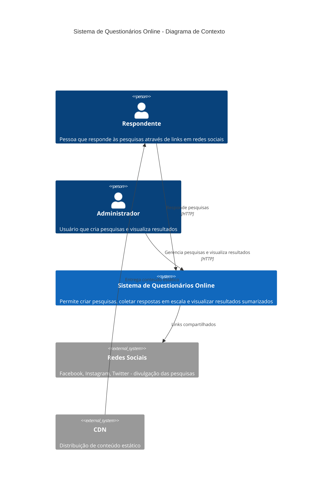
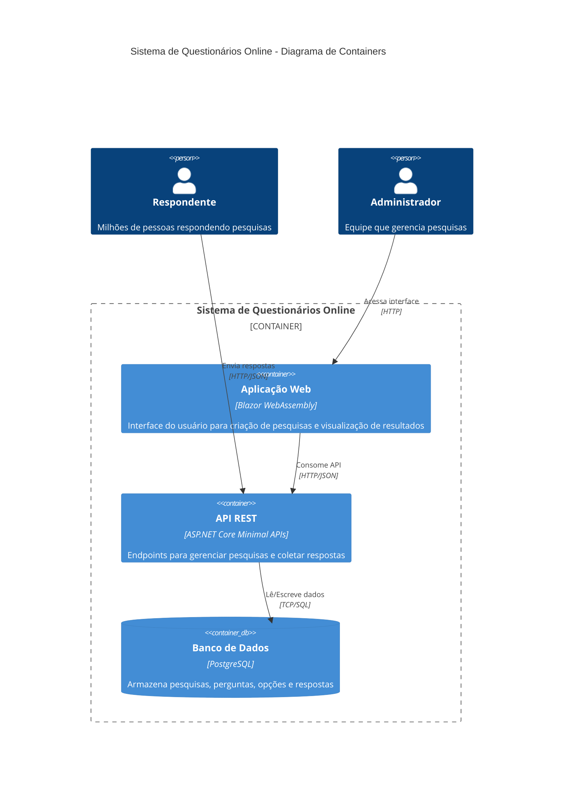
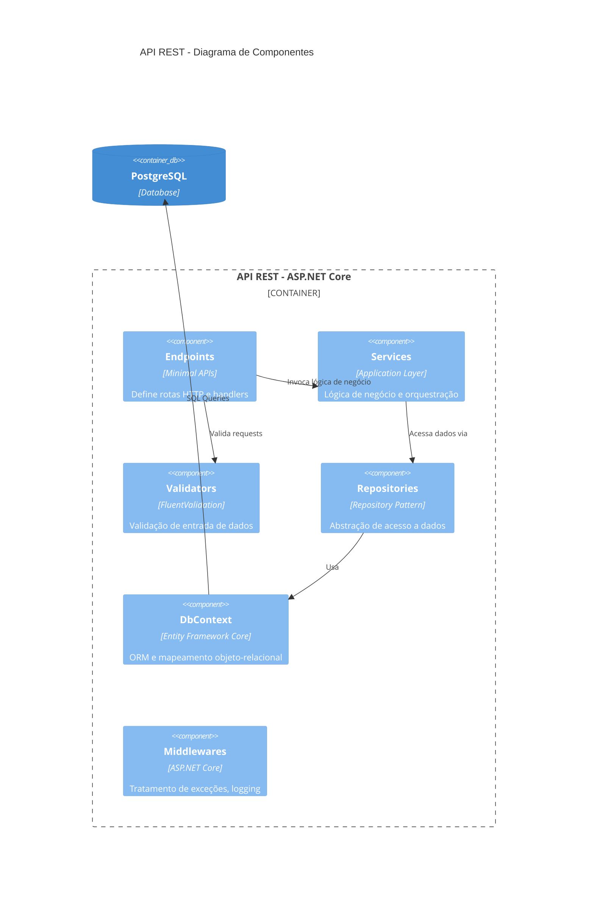
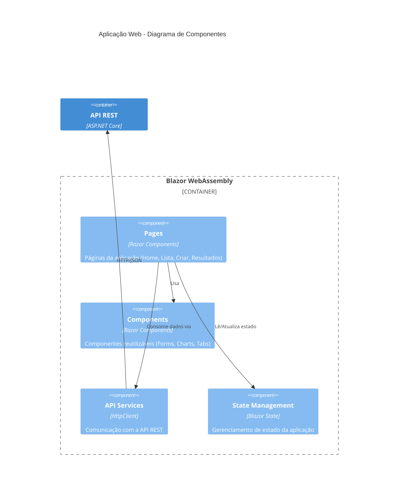
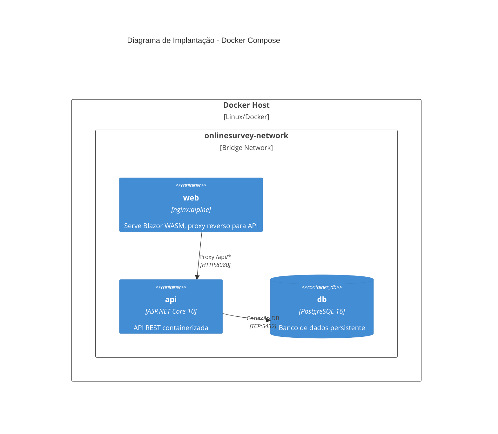
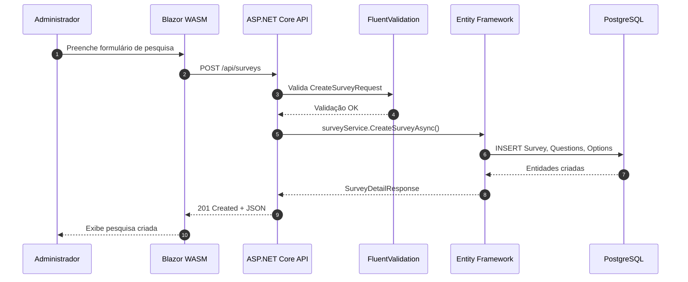
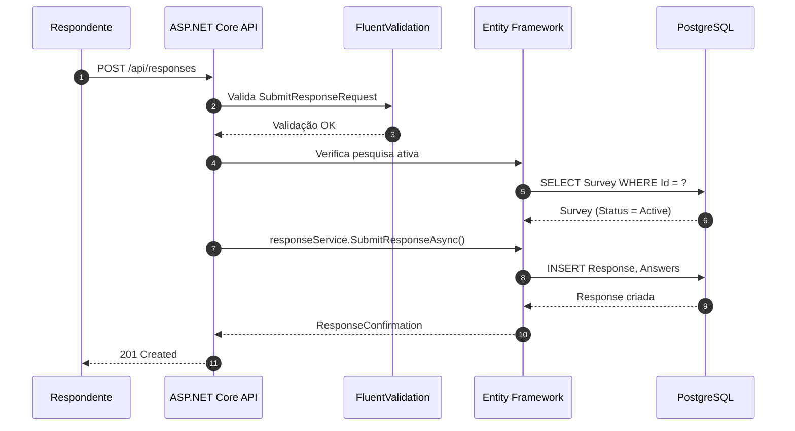
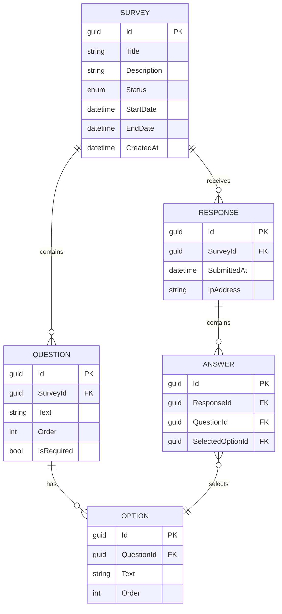
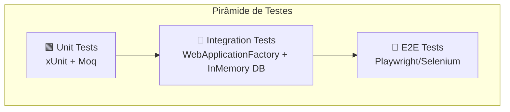

# Arquitetura do Sistema de Questionários Online

Este documento apresenta a arquitetura do Sistema de Questionários Online, projetado para suportar pesquisas públicas em larga escala, como pesquisas eleitorais. A solução foi desenvolvida utilizando o ecossistema .NET, priorizando escalabilidade, manutenibilidade e time-to-market.

---

## 1. Diagrama de Contexto (C4 - Nível 1)

O diagrama de contexto mostra o sistema como uma caixa preta e suas interações com usuários e sistemas externos.



### Visão para Usuários de Negócio

| Ator | Descrição | Interação |
|------|-----------|-----------|
| **Respondente** | Cidadão que acessa a pesquisa através de anúncios em redes sociais | Responde perguntas de múltipla escolha |
| **Administrador** | Equipe da startup que gerencia as pesquisas | Cria pesquisas, ativa/encerra coleta, visualiza resultados |

---

## 2. Diagrama de Containers (C4 - Nível 2)

O diagrama de containers mostra as aplicações e bancos de dados que compõem o sistema.



### Detalhamento dos Containers

| Container | Tecnologia | Justificativa |
|-----------|------------|---------------|
| **Aplicação Web** | Blazor WebAssembly | SPA moderna, executa no browser, permite desenvolvimento full-stack em C# |
| **API REST** | ASP.NET Core Minimal APIs | Alta performance, baixa latência, ideal para APIs de alto throughput |
| **Banco de Dados** | PostgreSQL | Open-source, robusto, excelente para cargas de escrita intensiva |

---

## 3. Diagrama de Componentes (C4 - Nível 3)

### 3.1 Componentes da API



### 3.2 Componentes do Frontend



---

## 4. Diagrama de Implantação



---

## 5. Fluxo de Dados

### 5.1 Fluxo de Criação de Pesquisa



### 5.2 Fluxo de Resposta (Alta Escala)



---

## 6. Modelo de Dados



---

## 7. Justificativas Arquiteturais

### 7.1 Para Desenvolvedores

#### Escolha do ASP.NET Core Minimal APIs

```csharp
// Exemplo de endpoint enxuto e performático
group.MapPost("/", CreateSurvey)
    .WithName("CreateSurvey")
    .Produces<SurveyDetailResponse>(StatusCodes.Status201Created)
    .ProducesValidationProblem();
```

**Por que escolhemos:**
- **Performance**: Menor overhead que controllers MVC, ideal para APIs de alto throughput
- **Simplicidade**: Código mais enxuto, menos boilerplate
- **Produtividade**: Time-to-market reduzido (crucial para prazo das eleições)
- **Documentação automática**: Integração nativa com Swagger/OpenAPI

#### Escolha do Entity Framework Core

```csharp
// Configuração fluente e type-safe
public class SurveyConfiguration : IEntityTypeConfiguration<Survey>
{
    public void Configure(EntityTypeBuilder<Survey> builder)
    {
        builder.HasMany(s => s.Questions)
               .WithOne(q => q.Survey)
               .HasForeignKey(q => q.SurveyId)
               .OnDelete(DeleteBehavior.Cascade);
    }
}
```

**Por que escolhemos:**
- **Produtividade**: Migrations automáticas, LINQ queries type-safe
- **Testabilidade**: Suporte a InMemory provider para testes de integração
- **Maturidade**: ORM mais utilizado no ecossistema .NET
- **Flexibilidade**: Suporta múltiplos providers (PostgreSQL, SQL Server, SQLite)

#### Escolha do FluentValidation

```csharp
public class CreateSurveyRequestValidator : AbstractValidator<CreateSurveyRequest>
{
    public CreateSurveyRequestValidator()
    {
        RuleFor(x => x.Title)
            .NotEmpty().WithMessage("Título é obrigatório")
            .MaximumLength(200);

        RuleFor(x => x.Questions)
            .NotEmpty().WithMessage("Pesquisa deve ter pelo menos uma pergunta");
    }
}
```

**Por que escolhemos:**
- **Separação de responsabilidades**: Validação desacoplada dos endpoints
- **Testabilidade**: Validators podem ser testados unitariamente
- **Mensagens customizáveis**: Feedback claro para usuários da API

#### Escolha do Blazor WebAssembly

**Por que escolhemos:**
- **Full-stack C#**: Equipe de 5 devs já conhece .NET/C#
- **Sem JavaScript**: Reduz complexidade e curva de aprendizado
- **SPA moderna**: Experiência de usuário fluida
- **Componentes reutilizáveis**: Razor Components para UI consistente

### 7.2 Para Usuários de Negócio

| Requisito de Negócio | Solução Técnica | Benefício |
|---------------------|-----------------|-----------|
| **Milhões de respostas** | PostgreSQL + Connection Pooling | Banco robusto para alta carga de escrita |
| **Disponibilidade 24/7** | Docker containers + Health checks | Fácil deploy e monitoramento |
| **Resultados em tempo real** | API REST eficiente | Agregação rápida de resultados |
| **Prazo curto (eleições)** | .NET stack unificado | Equipe já capacitada, sem curva de aprendizado |
| **Custos controlados** | PostgreSQL open-source | Sem custos de licenciamento |

---

## 8. Estratégia de Testes

### 8.1 Pirâmide de Testes



### 8.2 Testes de Integração da API

```csharp
public class SurveyEndpointsTests : IClassFixture<WebApplicationFactory<Program>>
{
    [Fact]
    public async Task CreateSurvey_WithValidData_ReturnsCreated()
    {
        // Arrange
        var request = new CreateSurveyRequest
        {
            Title = "Pesquisa Eleitoral 2026",
            Questions = [new CreateQuestionRequest { Text = "Em quem você votaria?" }]
        };

        // Act
        var response = await _client.PostAsJsonAsync("/api/surveys", request);

        // Assert
        response.StatusCode.Should().Be(HttpStatusCode.Created);
    }
}
```

**Cobertura de testes implementada:**
- ✅ 41 testes de integração passando
- ✅ Testes com banco InMemory (isolamento)
- ✅ Validação de endpoints
- ✅ Cenários de erro

### 8.3 Testes do Entity Framework

```csharp
// Configuração para testes com InMemory Database
services.AddDbContext<ApplicationDbContext>(options =>
    options.UseInMemoryDatabase("TestDb"));
```

**Por que InMemory para testes:**
- Execução rápida (sem I/O de disco)
- Isolamento entre testes
- Não requer container PostgreSQL

---

## 9. Conclusão

A arquitetura proposta atende aos requisitos do sistema de questionários online:

| Requisito | Atendimento |
|-----------|-------------|
| ✅ **Escala** | PostgreSQL + APIs stateless + Docker |
| ✅ **Prazo** | Stack .NET unificado (equipe já capacitada) |
| ✅ **Manutenibilidade** | Clean Architecture + Testes automatizados |
| ✅ **Custo** | Tecnologias open-source |
| ✅ **.NET Framework** | ASP.NET Core + EF Core + Blazor |

A solução é **pragmática**, focando em entregar valor no prazo das eleições, utilizando tecnologias maduras que a equipe de 5 desenvolvedores já domina.

---

**Autor:** Luan Fernandes
**Data:** Dezembro 2025
**Disciplina:** Arquitetura de Software .NET
